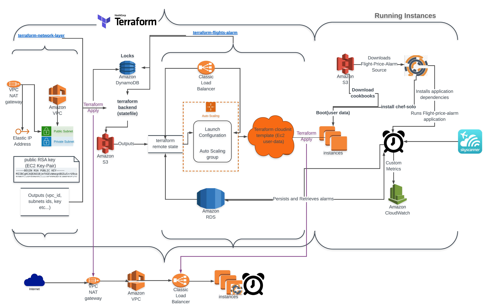

# Flight Price Alarm application
The goal of the application is to find flights for the budget.
The user sets the alarms by providing its origin place (city), destination(city), dates, and a threshold for the max price for a flight.

The app constantly querying the [Skyscanner](https://www.skyscanner.com/) API with all possible terminal codes of the airports in the origin and destination cities that fit the alarams' requirements, until an appropriate flight(s) is available, or when the departure date passed. 
When one or more flights are found, the app will look for the cheapest one and prints (later an email will be sent with) the details.
When finished (found an appropriate flight or the departure date has passed), the alarm will be deleted.

## Background
'Flight Price Alarm' Github repositories are my final [Cloud School](https://www.linkedin.com/company/cloud-school) project.
'Flight Price Alarm' is a Python(Flask) application. All the resources to deploy a full AWS environment with a cluster of application instances can be found in my Github (see "[How to deploy](#deploy)").

## How to use 'Flight Price Alarm'
### Step 1
Register with an 'email' and 'username' using the '/sign_up' API endpoint and get an API-Key

### Step 2
use '/alarm' endpoint to set a new alaram. provide:

-   'apikey' - the user identifier 
-   'maxprice' - the upper price threshold for a flight
-   'originplace' - city of departure
-   'destinationplace' - destination city
-   'outboundpartialdate' - departure date
-   'inboundpartialdate' - return date

##  How to deploy

### Prerequisites
AWS account and available AWS IAM permissions to deploy and use the relevant components.

### Upload the app to s3
- Clone this repo
- Archive and upload the repo to s3 (you can use the Jenkinsfile script found in this repo for that)

### Chef for configuration management
- Clone the [chef-flight-price-alarm](https://github.com/lightenzm/chef-flight-price-alarm) repository
- Archive and upload the repo to s3 (you can use the Jenkinsfile script found in the chef-repo for that)

### Terraform to provision the AWS network layer
- Clone the [terraform-network-layer](https://github.com/lightenzm/terraform-network-layer) repository
- cd the 'modules' directory
- type 'terraform apply' (the first time would require 'terraform init'. You will be required to fill the missing variables at this point if they are missing)
- The appropriate network components will be created in the AWS account (more details in the repo's readme and "[down here](#flow)")

### Terraform to provision the AWS application components
- Clone the [terraform-flights-alarm](https://github.com/lightenzm/terraform-flights-alarm) repository
- cd the 'modules' directory
- type 'terraform apply' (the first time would required 'terraform init'. You will be required to fill the missing variables at this point if they are missing)
- The appropriate components for running and communicating with the application will be created in the AWS account (more details in the repo's readme and "[down here](#flow)"))

### Monitor
The application sends custom metrics to Cloudwatch

### Persistence
The application manage the user configurations in a Mysql database

### <a name="flow">Flow

